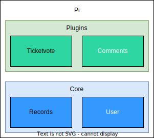
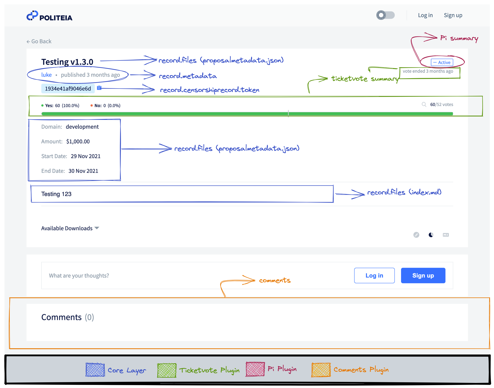

# PoliteiaGUI - Plugins Structure

A Guest User Interface configurable structure for creating multiple applications
using Politeia's [[1]](#ref-1) plugin architecture.

## Index

0. [Requirements](#requirements)
1. [Introduction](#introduction)
2. [GUI Composable Plugin Architecture](#gui-composable-plugin-architecture)
3. [Application Shell](#application-shell)
4. [Core](#core)

## Requirements

The following guide will assume you are familiar with the tools listed below. We
recommend you to take some time to study them before proceeding.

- [JavaScript](https://developer.mozilla.org/docs/Web/JavaScript)
- [Lerna](https://lerna.js.org/)
- [Yarn Workspaces](https://yarnpkg.com/features/workspaces)
- [Politeia](https://github.com/decred/politeia)
- [Redux](https://redux.js.org/)
- [Redux Toolkit](https://redux-toolkit.js.org/)
- [Window History](https://developer.mozilla.org/docs/Web/API/Window/history)

## Introduction

Politeia is the underlying platform that provides a versioned, timestamped data
store, which can be used for creating new applications on top of it.

> The original motivations behind Politeia were to create a platform that would
> allow the Decred stakeholders to manage the Decred treasury. This platform
> would let individuals and teams submit proposals (i.e. requests for funding
> from the treasury) and would facilitate the Decred stakeholders voting on
> whether to fund the proposal or reject it. The data would be stored off-chain,
> but would be episodically timestamped onto the Decred blockchain" - _Politeia:
> Pi 2021 Q3 (Proposal System)_ [[2]](#ref-2).

A lot of applications can benefit from this design, that's why we decided to
create a composable plugin architecture. Developers are now able to create
plugins to interact, extend and manage the records stored and create awesome
applications with it, such as [Decred's Proposal system
(Pi)](https://proposals.decred.org) and [Decred's Contractor Management System
(CMS)](https://cms.decred.org/) _(CMS not implemented on the new architecture
yet)_.

PoliteiaGUI is the Guest User Interface side of Politeia, which stands for the
same principles of a **plugin-composable architecture**. It is responsible for
displaying the multiple stored Records on a user-friendly interface, helping
people who aren't familiar with programming and CLI management also interact
and use the functionalities provided by the regarded system.

The architecture consists in a composition of one or more plugins that extend
the Core functionalities. For example, plugins can enhance Records by providing
extra information, data, statuses, etc. using its own isolated design. This will
provide a reusable structure for multiple applications, which will provide a
better code maintainance and scalability.

On the Frontend side, it means we can provide different UXs depending on the
plugins combinations. We can integrate multiple plugins for customizing some
app, and still not trigger collateral effects on other plugins.

## GUI Composable Plugin Architecture

The GUI architecture is a mono-repository structure, composed by
plugins, managed by [Lerna](https://lerna.js.org/) and [Yarn
Workspaces](https://yarnpkg.com/features/workspaces), containing two
different types of workspaces: _Apps_ and _Packages_.

- Apps: workspace for **application shells**. It's used for plugins integration
  into one user application.
- Packages: workspace for plugins. Each **plugin** has its own isolated config,
  and can compose the application shell by extending the **core** package and
  adding new features, new routes, and also a custom UI.

The following diagram displays an overview of the regarded plugin architecture
for the proposals (Pi) application:

  

Politeia (Pi) is the application-shell. Ticketvote and Comments are plugins that
extend the core Record package.

## Application Shell

The application shell is the bridge between the application user and the
plugins. It implements UX-oriented features, and specific setup for some regular
app. In the example displayed above, Politeia is responsible for integrating the
multiple plugins, by adding wrappers around the plugins/core tools, and
providing a custom user interface.

The following diagram illustrates the Proposal Details page on the Pi app:

  

The Pi plugin is responsible for consuming the core Records layer and decode
each record as a proposal. Notice that, since the Pi plugin is built focusing
on the Proposals System, the Pi App-shell will implement it.

Each proposal also has its own comments tree, therefore, it can combine the
Records layer and Comments plugin.

Also, users can check voting details for proposals due to the inclusion of the
Ticketvote plugin.

Notice that the Icon, the dark-mode toggle, "Go Back" link, the page layout
(components order, screen display) are controlled by the application shell,
and, as mentioned before, are configured focusing on the UX.

We could also create applications with different combinations of plugins. One
good example is the Contractor Management System (CMS). CMS could use invoices
as application records, also implement comments for each invoice and create new
plugins to add custom functionality.

## References

<a id="ref-1">1</a>. lukebp, alexlyp, marcopeereboom, dajohi, amass01, thi4go,
victorgcramos, tiagoalvesdulce, vibros68 . . . (2021). _Politeia_ (1.2.0)
[Politeia is a system for storing off-chain data that is both versioned and
timestamped]. Decred. https://github.com/decred/politeia

<a id="ref-2">2</a>. lukebp. (2021, May 6). _Politeia: Pi 2021 Q3 (Proposal
System)_. Politeia Proposal. https://proposals.decred.org/record/91cfcc8

<a id="ref-3">3</a>. Redux Toolkit v1.6.1. _Redux Toolkit_.
https://redux-toolkit.js.org

<a id="ref-4">4</a>. Redux - A predictable state container for JavaScript apps.
_Redux_. https://redux.js.org.
