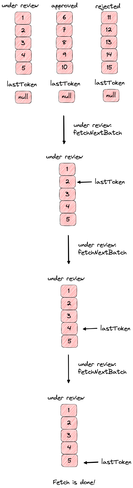

# Core

The core package includes the base layers for plugins. It contains generic data,
its own api consuming, state, and router management tools. It's also a generic
Node Package and can be easily integrated by importing them with your favorite
package management tool on any JavaScript application or plugin.

## Summary

- [Files Structure](#files-structure)
- [Exports](#exports)
- [Testing](#testing)
- [Store](#core-store)
- [Client](#core-client)
- [Records](#core-records)
- [Router](#core-router)
- [Plugin Setup](#core-plugin-setup)
- [App Setup](#core-app-setup)
- [References](#references)

## <a id="files-structure"></a> Files Structure

```bash
├── /public
├── /src
│   ├── /api
│   ├── /client
│   ├── /dev
│   ├── /records
│   │   ├── /inventory
│   │   ├── /pages
│   │   ├── /policy
│   │   ├── /records
│   │   ├── /ui
│   │   ├── constants.js
│   │   ├── errors.js
│   │   ├── initializers.js
│   │   ├── utils.js
│   │   ├── utils.test.js
│   │   ├── validation.js
│   │   └── validation.test.js
│   ├── /router
│   ├── /routes
│   ├── /styles
│   ├── index.js
│   ├── storeSetup.js
│   └── utils.js
├── README.md
├── jest.config.js
├── package.json
├── webpack.common.js
├── webpack.dev.js
└── webpack.prod.js
```

## <a id="exports"></a> Exports

You can use the core package tools by importing them from `@politeiagui/core`.
Exports are defined on `package.json`

```javascript
// package.json
// ...
"exports": {
  ".": "./src/index.js", // @politeiagui/core
  "./api": "./src/api/index.js", // @politeiagui/core/api
  "./client": "./src/client/index.js", // @politeiagui/core/client
  "./records": "./src/records/records/index.js", // @politeiagui/core/records
  "./records/inventory": "./src/records/inventory/index.js", // @politeiagui/core/records/inventory
  "./records/policy": "./src/records/policy/index.js", // @politeiagui/core/records/policy
  "./records/ui": "./src/records/ui/index.js",// @politeiagui/core/records/ui
  "./router": "./src/router/index.js", // @politeiagui/core/router
  "./routes": "./src/routes/index.js" // @politeiagui/core/routes
// ...
},
```

## <a id="testing"></a> Testing

Testing scripts are defined on `package.json`:

```javascript
// package.json
// ...
"scripts": {
  "test:format": "yarn prettier --check",

  "test:eslint": "eslint --ext .js ./src",

  "test:ci": "npm run test:format && npm run test:eslint && cross-env NODE_OPTIONS=--experimental-vm-modules jest --no-cache",

  "test:dev": "npm run test:format && npm run test:eslint && cross-env NODE_OPTIONS=--experimental-vm-modules jest --watchAll --no-cache",

  "test": "is-ci \"test:ci\" \"test:dev\"",

  "test:coverage": "yarn test:ci; open coverage/lcov-report/index.html",
},
// ...
```

**Run Unit Tests**:

```bash
$ yarn && yarn test
```

## <a id="core-store"></a> Store

The Core package exports a custom Redux Store, containing Core slices for the
two main Layers of Politeia: Records and Users (work in progress).

<!-- TODO: code from src/storeSetup.js -->

The custom `store` is configured using the
[`configureStore`](https://redux-toolkit.js.org/api/configureStore) method from
Redux Toolkit.

You can inject custom reducers into the `store` using the `store.injectReduer`
async method.

```javascript
async function injectMyReducer() {
  await store.injectReducer("myReducerName", myReducer);
}
```

This will connect your reducer into the Core `store`, and allow it to be
accessible to any app connected to it.

### <a id="core-reducers-slices"></a> Reducers and Slices

Redux Toolkit allows us to isolate our multiple Redux Tree using the
[`createSlice`](https://redux-toolkit.js.org/api/createSlice) method, where
each slice is a combination of reducers and actions:

> _"A function that accepts an initial state, an object of reducer functions,
> and a "slice name", and automatically generates action creators and action
> types that correspond to the reducers and state."_ Redux-Toolkit Slice docs

On a quick explanation, each slice has its `initialState`, which defines all
initial values for our `state`. On the Redux pattern, states can only be
modified by dispatching actions. Each action has its own way to modify the
state, and Redux Toolkit allows us to use ImmerJS to access and do the regarded
changes on our state.

Let's build a custom Slice to inject it into the `store`.

```javascript
// dataManagementSlice.js

// First, import methods from Redux Toolkit
import { createSlice, createAsyncThunk } from "@reduxjs/toolkit";
import { fetchData } from "./api";

// Let's define our initialState
const myInitialState = {
  data: {},
  status: "idle",
  error: null,
};

// Define the Async thunk responsible for managing async actions.
export const fetchData = createAsyncThunk(
  "dataManagement/fetch",
  async (_, { rejectWithValue }) => {
    try {
      return await fetchData(); // fetchData returns a Promise
    } catch (e) {
      return rejectWithValue(e.message);
    }
  }
);

// Creating our dataManagement slice
const mySlice = createSlice({
  name: "dataManagement",
  initialState: myInitialState,
  reducers: {},
  // Define reducers for fetchData thunk.
  extraReducers(builder) {
    builder
      // ImmerJS already modifies our state, so we don't need
      // to return it like we are used to do with regular reducers.
      .addCase(fetchData.pending, (state) => {
        state.status = "loading";
      })
      .addCase(fetchData.fulfilled, (state, action) => {
        state.status = "succeeded";
        state.data = { ...state.data, ...action.payload };
      })
      .addCase(fetchData.rejected, (state, action) => {
        state.status = "failed";
        state.error = action.payload;
      });
  },
});
// Exports reducer so we can inject it into our store
export default mySlice.reducer;
```

The flow chart below describes the updates made on the `state` when calling
the `fetchData` thunk:


Notice that, when `fetchData` dispatches, it will first update the state to
`loading`, and when the promise resolves, if successful, update the status to
`succeeded` and include the received data on the state. If the request fails, it
will update the status to `failed` and update the error.

### Connect Reducers

Let's connect our `dataManagement` reducer into the Core `store`.

```javascript
// myApp.js
import dataManagementReducer, { fetchData } from "./dataManagementSlice.js";
import { store, connectReducers } from "@politeiagui/core";

async function MyApp() {
  // As a good practice, it's recommended to pass the same slice name to the
  // reducer's name.
  await store.injectReducer("dataManagement", dataManagementReducer);
  // You can use `connectReducers` util to inject more than one reducer
  await connectReducers([
    { key: "dataManagement", reducer: dataManagementReducer },
  ]);

  // Case 1: promise resolves correctly with no errors
  await store.dispatch(fetchData());
  let state = store.getState();
  // { data: { ...myData }, status: "succeeded", error: null }

  // Case 2: promise still being resolved
  store.dispatch(fetchData());
  state = store.getState();
  // { data: {}, status: "loading", error: null }

  // Case 3: promise rejects with "ERROR" error message
  await store.dispatch(fetchData());
  state = store.getState();
  // { data: {}, status: "failed", error: "ERROR" }
}
```

## <a id="core-client"></a> Client

The Client is used for sharing common methods among all plugins that share the
same [`store`](#core-store).

<!-- TODO: explain pki and sign utils -->

```javascript
export const client = {
  async fetchRecordsInventory(obj) {
    // calls /api/records/v1/inventory
  },
  async fetchRecords(state, records) {
    // calls /api/records/v1/records
  },
  async fetchApi() {
    // calls /api
  },
  async fetchRecordsPolicy(state) {
    // calls /api/records/v1/policy
  },
};
```

Client methods are available for usage as a thunk's `extra` param:

```javascript
// storeSetup.js
const store = configureStore(
  {
    reducer: { ...staticReducers },
    middleware: (getDefaultMiddleware) =>
      getDefaultMiddleware({
        // This will make the client available in the 'extra' argument
        // for all our thunks created with createAsyncThunk
        thunk: {
          extraArgument: client,
        },
      }),
  },
  initialState
);
```

We can use them with the following approach:

```javascript
// records/recordsSlice.js

/**
 * fetchRecords async thunk responsible for fetching records for given
 * { token, filename } array.
 *
 * @returns {Array} Records
 */
export const fetchRecords = createAsyncThunk(
  "records/fetch",
  async (body, { getState, extra, rejectWithValue }) => {
    try {
      // extra.fetchRecords is the method used for calling
      // /api/records/v1/records endpoint.
      return await extra.fetchRecords(getState(), body);
    } catch (e) {
      return rejectWithValue(e.message);
    }
  },
  {
    // condition defines the criteria required for calling the fetchRecords
    // thunk. If condition is `false`, fetchRecords is not dispatched.
    condition: (records) => isArray(records),
  }
);
```

## <a id="core-records"></a> Records

Records is the core layer for handling records and their inventory. It wraps
Records and Inventory slices for state management, constants for default record
structure, utility and validation methods.

### Summary

- [`record`](#record-structure)
  - [`state`](#record-state)
  - [`status`](#record-status)
  - [`files`](#record-files)
  - [`metadata`](#record-metadata)
  - [`censorshiprecord`](#record-censorshiprecord)
  - [Example](#record-example)
- [Records Slice](#records-slice)
  - [`async records.fetch([...tokens])`](#records-fetch)
  - [`records.selectStatus(state)`](#records-selectstatus)
  - [`records.selectByToken(state, token)`](#records-selectbytoken)
  - [`records.selectAll(state)`](#records-selectall)
  - [`records.selectByStateAndStatus(state, { recordsState, status })`
    ](#records-selectbystateandstatus)
- [Inventory Slice](#records-inventory)
  - [`async recordsInventory.fetch({ recordsState, status, page })`
    ](#inventory-fetch)
  - [`recordsInventory.selectByStateAndStatus(state, { recordsState, status })`
    ](#inventory-selectbystateandstatus)
  - [`recordsInventory.selectStatus(state, { recordsState, status })`
    ](#inventory-selectstatus)
- [Policy Slice](#records-policy)
  - [`async recordsPolicy.fetch()`](#policy-fetch)
  - [`recordsPolicy.select(state)`](#policy-select)
  - [`recordsPolicy.selectStatus(state)`](#policy-selectstatus)
- [Record Utils](#record-utils)

### <a id="record-structure"></a> `record`

A `record` has the following structure:

| Field                                          | Type   | Description                                            |
| ---------------------------------------------- | ------ | ------------------------------------------------------ |
| [`state`](#record-state)                       | Number | 1 (vetted), 2 (unvetted)                               |
| [`status`](#record-status)                     | Number | 1 (unreviewed), 2 (public), 3 (censored), 4 (archived) |
| [`metadata`](#record-metadata)                 | Array  | Record's extra information                             |
| [`files`](#record-files)                       | Array  | Record's editable content                              |
| [`censorshiprecord`](#record-censorshiprecord) | Object | Record's proof of existence                            |
| `version`                                      | Number | Record Version edit                                    |
| `timestamp`                                    | Number | timestamp of the latest record change                  |
| `username`                                     | String | Author's username                                      |

As you can see, a record does not provide explicit information about its
content. The following section will cover each attribute and its regarded
meaning for the application.

#### <a id="record-state"></a> `state`

Describes whether some record is vetted or unvetted. Vetted records are
accessible to anyone, while unvetted records can only be retreived by admins
or the record's author.

| Value | Label      | Description           |
| ----- | ---------- | --------------------- |
| 1     | `vetted`   | Accessible to anyone  |
| 2     | `unvetted` | Admin and author only |

> `state` is a variable name used as a pattern when regarding to Redux's State,
> therefore, we use `recordState` on our code to refer to record's state.

#### <a id="record-status"></a> `status`

Describes the status of some record. Each status has its own particular
role:

| Value | Label          | Description                                  |
| ----- | -------------- | -------------------------------------------- |
| 1     | `unreviewed`\* | Record hasn't been made public yet           |
| 2     | `public`\*\*   | Anyone can see the record and its content    |
| 3     | `censored`     | Content deleted, and updates blocked         |
| 4     | `archived`     | Updates blocked, but content remains visible |

> \* Unreviewed records will always be [`unvetted`](#record-state). \*\* Public
> records will always be [`vetted`](#record-state).

Every new record will receive the `unreviewed` status, and needs to be approved
by an admin to be visible publicly. Once the record is `public`, it can't become
`unreviewed`.

Censored and Archived records can be either `vetted` or `unvetted`. Only admins
can set the `censored` status, while only authors can set the `archived` status.

#### <a id="record-files"></a> `files`

Contains the record's content. It can be any set of data, encoded, digested and
submitted according to the following structure:

| Field   | Type   | Description                        |
| ------- | ------ | ---------------------------------- |
| name    | String | File name                          |
| mime    | String | File MIME type                     |
| digest  | String | SHA256 digest of unencoded payload |
| payload | String | File content, base64 encoded       |

Notice that the file itself does not provide human readable content, unless it's
decoded by some plugin. Each plugin can decode records according to plugin's
rules.

#### <a id="record-metadata"></a> `metadata`

Metadata streams provides information from plugins. Plugins may attach extra
information into some record. A single metadata stream is described by the
following structure:

| Field    | Type   | Description          |
| -------- | ------ | -------------------- |
| pluginid | String | Metadata Plugin ID   |
| streamid | Number | Metadata Stream ID   |
| payload  | String | JSON encoded content |

#### <a id="record-censorshiprecord"></a> `censorshiprecord`

Contains cryptographic proof that a record was accepted for review by the
server. The proof is verifiable by the client.

| Field     | Type   | Description                                      |
| --------- | ------ | ------------------------------------------------ |
| token     | String | Unique random [Record](#core-records) identifier |
| merkle    | Number | ordered merkle root of all files in the record.  |
| signature | String | Signature of the merkle + token                  |

#### <a id="record-example"></a> Example

To illustrate the structure above, let's take a look inside a record payload:

```json
{
  "state": 1,
  "status": 1,
  "version": 1,
  "timestamp": 1643654195,
  "username": "admin",
  "metadata": [
    {
      "pluginid": "usermd",
      "streamid": 1,
      "payload": "{\"userid\":\"36961143-f7dd-498a-8306-425bf31ad5b4\",\"publickey\":\"e23c46e65af161f4b55b5a73a499578813cff9af2a17b7a955d0504892cc5db2\",\"signature\":\"cd1eb7358267aab574a29c6abc03589d324d369c91050dc1c2038f5c5087a6b20a0ffd859574ab7ded2ccee776372deb56f189bdbefd493554e5a350ba610f0b\"}"
    }
  ],
  "files": [
    {
      "name": "index.md",
      "mime": "text/plain; charset=utf-8",
      "digest": "17012ab8b7a847e1995fda027006b712ad7dacb7c2be9c88eff7eb14eadcbb0f",
      "payload": "TG9yZW0gaXBzdW0gZG9sb3Igc2l0IGFtZXQsIGNvbnNlY3RldHVyIGFkaXBpc2NpbmcgZWxpdC4gUXVpc3F1ZSBjb25zZXF1YXQgbGFjaW5pYSBpcHN1bSwgc2l0IGFtZXQgdWx0cmljZXMgb2RpbyBjb21tb2RvIHV0LiBQaGFzZWxsdXMgbmVjIGxpYmVybyB2aXRhZSBmZWxpcyBkaWN0dW0gY29tbW9kby4gTnVsbGFtIHNlZCBtZXR1cyB0b3J0b3Iu"
    },
    {
      "name": "proposalmetadata.json",
      "mime": "text/plain; charset=utf-8",
      "digest": "b3d934fbe07c3aad9661b7c193f2c9d65b5751327b43e75edabff6ffa07ff00d",
      "payload": "eyJuYW1lIjoiTXkgUHJvcG9zYWwiLCJhbW91bnQiOjEwMDAwMCwic3RhcnRkYXRlIjoxNjQ1MjI4NzQwLCJlbmRkYXRlIjoxNjc0NTE4MzQwLCJkb21haW4iOiJkZXZlbG9wbWVudCJ9"
    }
  ],
  "censorshiprecord": {
    "token": "7d6576ddc84e7261",
    "merkle": "9623208c1ffdb4bd9eca6f897c98fdbc84521de65c1b16515b711da584f9bcc0",
    "signature": "a29f4b234915e7bfa4b4ec566c1bc7bbdc0a7861424e64b7bd2997b678142f59988bde5a281cb7f9f94245db9e31a865b9d23b1e6e8957d6bb560e996a0d1407"
  }
}
```

If we decode the information from the given payload, we would get the following
result:

<p align="center">
  
</p>

Files:

- `proposalmetadata.json` contains the encoded JSON proposal metadata for
  `name`, `domain`, `amount`, `startdate`, `enddate`.
- `index.md` contains the proposal body.
- Any record with a `proposalmetadata.json` file is considered a **Proposal**.

Metadata:

- `usermd` contains author's information, such as its `userid`, `publickey` and
  `signature`

### <a id="records-slice"></a> Records Slice

The Records slice is used for managing the Records State and Actions. Its state
is responsible for storing errors, fetching status, and record data.

- `initialState`

  Records reducer initial state:

  ```javascript
  export const initialState = {
    records: {}, // Records data by token
    status: "idle", // Fetch status: 'idle' | 'loading' | 'succeeded' | 'failed'
    error: null,
  };
  ```

- <a id="records-fetch"></a> `async records.fetch([...tokens])`

  Async thunk responsible for fetching records for given `tokens` array It
  returns a `{ [token]: record }` map and updates `records` state.

  | Param  | Type               | Description   |
  | ------ | ------------------ | ------------- |
  | tokens | <code>Array</code> | Record tokens |

  **Usage:**

  ```javascript
  import { store } from "@politeiagui/core";
  import { records } from "@politeiagui/core/records";

  await store.dispatch(records.fetch(["token1", "token2", "token3"]));
  const recordsFetched = store.getState().records;
  // { [token1]: {...record1}, [token2]: {...record2}, [token3]: {...record3} }
  const recordsFetchStatus = store.getState().status;
  // "succeeded"
  ```

- <a id="records-selectstatus"></a><code>records.selectStatus(state)</code>

  Returns the current Records fetch status.

  | Param | Type                | Description       |
  | ----- | ------------------- | ----------------- |
  | state | <code>Object</code> | Redux Store state |

  **Usage:**

  ```javascript
  import { store } from "@politeiagui/core";
  import { records } from "@politeiagui/core/records";

  // fetchRecords not called yet
  const recordsFetchStatus = records.selectStatus(store.getState());
  // "idle"
  ```

- <a id="records-selectbytoken"></a><code>
  records.selectByToken(state, token)
  </code>

  Returns a Record for given `state` and `token`.

  | Param | Type                | Description       |
  | ----- | ------------------- | ----------------- |
  | state | <code>Object</code> | Redux Store state |
  | token | <code>String</code> | Record token      |

  **Usage:**

  ```javascript
  import { store } from "@politeiagui/core";
  import { records } from "@politeiagui/core/records";
  // fetch records first
  await records.fetch(["token1"]);
  // Select `token1` record
  const record = records.selectByToken(store.getState(), "token1");
  // { ...record1 }
  ```

- <a id="records-selectall"></a><code>records.selectAll(state)</code>

  Returns all records for given `state`.

  | Param | Type                | Description       |
  | ----- | ------------------- | ----------------- |
  | state | <code>Object</code> | Redux Store state |

  **Usage:**

  ```javascript
  import { store } from "@politeiagui/core";
  import { records } from "@politeiagui/core/records";
  // Fetch records first
  await records.fetch(["token1", "token2", "token3"]);
  // Select all records
  const allRecords = records.selectAll(store.getState());
  // { [token1]: {...record1}, [token2]: {...record2}, [token3]: {...record3} }
  ```

- <a id="records-selectbystateandstatus"></a><code>
  records.selectByStateAndStatus(state, { recordsState, status })
  </code>

  Returns all records for given `state`, `recordsState` and `status`.

  | Param          | Type                | Description               |
  | -------------- | ------------------- | ------------------------- |
  | state          | <code>Object</code> | Redux Store state         |
  | selectorParams | <code>Object</code> | `{ recordState, status }` |

  **Usage:**

  ```javascript
  import { store } from "@politeiagui/core";
  import { records } from "@politeiagui/core/records";
  // Fetch records first
  await records.fetch(["token1", "token2", "token3"]);

  const unreviewedRecords = records.selectByStateAndStatus(store.getState(), {
    recordsState: "unvetted",
    status: "unreviewed",
  });
  // { [token1]: {...record1, status: 1, state: 1} }
  ```

### <a id="records-inventory"></a> Inventory Slice

An `inventory` is a `{ [state]: { [status]: [...tokens] } }` map used to index
[`record tokens`](#records-censorshiprecord). You can use your inventory to
organize the tokens by `status`, `recordsState` and other kinds of indexes.

- `initialState`

  Inventory Slice initial state:

  ```javascript
  export const initialState = {
    // unvetted recordsState
    unvetted: {
      censored: {
        tokens: [],
        lastPage: 0,
        status: "idle",
      },
      unreviewed: {
        tokens: [],
        lastPage: 0,
        status: "idle",
      },
    },
    // vetted recordsState
    vetted: {
      archived: {
        tokens: [],
        lastPage: 0,
        status: "idle",
      },
      censored: {
        tokens: [],
        lastPage: 0,
        status: "idle",
      },
      public: {
        tokens: [],
        lastPage: 0,
        status: "idle",
      },
    },
    error: null,
  };
  ```

- <a id="inventory-fetch"></a>
  `async recordsInventory.fetch({ recordsState, status, page })`

  Async thunk responsible for fetching a paginated inventory for given
  `recordsState`, `status` and `page` parameters. `recordsState` and `status`
  must be valid.

  | Param | Type                | Description                     |
  | ----- | ------------------- | ------------------------------- |
  | body  | <code>Object</code> | `{ recordState, status, page }` |

  **Usage:**

  ```javascript
  import { store } from "@politeiagui/core";
  import { recordsInventory } from "@politeiagui/core/records/inventory";

  // fetch unvetted and unreviewed inventory tokens
  await store.dispatch(
    recordsInventory.fetch({
      recordsState: 1,
      status: 1,
      page: 1,
    })
  );
  const unreviewedInventory = store.getState().unvetted.unreviewed;
  // {
  //    tokens: ["token1", "token2", "token3"],
  //    status: "succeeded/isDone",
  //    lastPage: 1
  // }
  ```

- <a id="inventory-fetch"></a>
  `async recordsInventory.fetchNextRecordsBatch({ recordsState, status })`

  Async thunk responsible for fetching a paginated records batch for given
  `recordsState` and `status` parameters. `recordsState` and `status` must be
  valid.

  The diagram below illustrates the approach used by the `fetchNextRecordsBatch`
  method:

  <details>
    <summary>Click to expand!</summary>
    <p align="center" style="max-width:400px;">
      
    </p>
  </details>

  | Param | Type                | Description               |
  | ----- | ------------------- | ------------------------- |
  | body  | <code>Object</code> | `{ recordState, status }` |

  **Usage:**

  ```javascript
  import { store } from "@politeiagui/core";
  import { recordsInventory } from "@politeiagui/core/records/inventory";

  // fetch unvetted and unreviewed records
  await store.dispatch(
    recordsInventory.fetchNextBatch({ recordsState: 1, status: 1 })
  );
  const recordsFetched = store.getState().records.records;
  // {
  //    token1: { ...record1 },
  //    token2: { ...record2 }
  // }
  ```

- <a id="inventory-selectbystateandstatus"></a>
  `recordsInventory.selectByStateAndStatus(state, { recordsState, status })`

  Returns an array of tokens for given `state`, `recordsState` and `status`.

  | Param          | Type                | Description               |
  | -------------- | ------------------- | ------------------------- |
  | state          | <code>Object</code> | Redux Store state         |
  | selectorParams | <code>Object</code> | `{ recordState, status }` |

  **Usage:**

  ```javascript
  import { store } from "@politeiagui/core";
  import { recordsInventory } from "@politeiagui/core/records/inventory";

  // fetch unvetted and unreviewed records
  await store.dispatch(
    recordsInventory.fetch({
      recordsState: 1,
      status: 1,
      page: 1,
    })
  );

  const state = store.getState();
  const unreviewedTokens = recordsInventory.selectByStateAndStatus(state, {
    recordsState: 1,
    status: 1,
  });
  // ["token1", "token2", "token3"]
  ```

- <a id="inventory-selectstatus"></a>
  `recordsInventory.selectStatus(state, { recordsState, status })`

  Returns the current Inventory slice fetch status for given `state`,
  `recordsState` and `status`.

  | Param          | Type                | Description               |
  | -------------- | ------------------- | ------------------------- |
  | state          | <code>Object</code> | Redux Store state         |
  | selectorParams | <code>Object</code> | `{ recordState, status }` |

  **Usage:**

  ```javascript
  import { store } from "@politeiagui/core";
  import { recordsInventory } from "@politeiagui/core/records/inventory";

  // fetch unvetted and unreviewed records
  await store.dispatch(
    recordsInventory.fetch({
      recordsState: 1,
      status: 1,
      page: 1,
    })
  );
  const state = store.getState();
  const unreviewedFetchStatus = recordsInventory.selectStatus(state, {
    recordsState: 1,
    status: 1,
  });
  // "succeeded/isDone"
  ```

- <a id="inventory-selectlastpage"></a>
  `recordsInventory.selectLastPage(state, { recordsState, status })`

  Returns the last page index for given `state`, `recordsState` and `status`.

  | Param          | Type                | Description               |
  | -------------- | ------------------- | ------------------------- |
  | state          | <code>Object</code> | Redux Store state         |
  | selectorParams | <code>Object</code> | `{ recordState, status }` |

  **Usage:**

  ```javascript
  import { store } from "@politeiagui/core";
  import { recordsInventory } from "@politeiagui/core/records/inventory";

  // fetch unvetted and unreviewed records. Returns 3 tokens.
  await store.dispatch(
    recordsInventory.fetch({
      recordsState: 1,
      status: 1,
      page: 1,
    })
  );
  const state = store.getState();
  const unreviewedFetchStatus = recordsInventory.selectLastPage(state, {
    recordsState: 1,
    status: 1,
  });
  // 1;
  ```

### <a id="records-policy"></a> Policy Slice

The records policy slice is used for storing and managing server's policy for
records API.

- `initialState`:

  ```javascript
  export const initialState = {
    policy: {},
    status: "idle",
    error: null,
  };
  ```

- <a id="policy-fetch"></a> `async recordsPolicy.fetch()`

  Async thunk used to fetch records API policy.

  **Usage:**

  ```javascript
  import { store } from "@politeiagui/core";
  import { recordsPolicy } from "@politeiagui/core/records/policy";

  await store.dispatch(recordsPolicy.fetch());

  const policy = store.getState().policy;
  // { inventorypagesize: 20, recordspagesize: 5 }
  ```

- <a id="policy-select"></a> `recordsPolicy.select(state)`

  Returns `policy` rules for given `state`.

  | Param | Type                | Description       |
  | ----- | ------------------- | ----------------- |
  | state | <code>Object</code> | Redux Store state |

  **Usage:**

  ```javascript
  import { store } from "@politeiagui/core";
  import { recordsPolicy } from "@politeiagui/core/records/policy";

  await store.dispatch(recordsPolicy.fetch());

  const policy = recordsPolicy.select(store.getState());
  // { inventorypagesize: 20, recordspagesize: 5 }
  ```

- <a id="policy-selectstatus"></a> `recordsPolicy.selectStatus(state)`

  Returns the records policy fetch status.

  | Param | Type                | Description       |
  | ----- | ------------------- | ----------------- |
  | state | <code>Object</code> | Redux Store state |

  **Usage:**

  ```javascript
  import { store } from "@politeiagui/core";
  import { recordsPolicy } from "@politeiagui/core/records/policy";

  await store.dispatch(recordsPolicy.fetch());

  const policy = recordsPolicy.selectStatus(store.getState());
  // "succeeded"
  ```

### Records Utils

The Core package also exports **records utils**, which can be used for managing
records from other plugins and apps. You can check the available utils below:

- <a id="utils-gethumanreadablerecordstatus"></a>
  `getHumanReadableRecordStatus(status)`

  Returns the readable record status and throws an error if status is invalid or
  does not exist.

  | Param  | Type                          | Description   |
  | ------ | ----------------------------- | ------------- |
  | status | <code>Number or String</code> | record status |

  **Usage:**

  ```javascript
  import { getHumanReadableRecordStatus } from "@politeiagui/core/records/utils";
  const readableStatus = getHumanReadableRecordStatus(record.status);
  ```

- <a id="utils-getrecordstatuscode"></a> `getRecordStatusCode(status)`

  Returns the valid status code for given status. If status is invalid, an error
  is thrown.

  | Param  | Type                          | Description   |
  | ------ | ----------------------------- | ------------- |
  | status | <code>Number or String</code> | record status |

  **Usage:**

  ```javascript
  import { getRecordStatusCode } from "@politeiagui/core/records/utils";
  const statusCode = getRecordStatusCode(record.status);
  ```

- <a id="utils-gethumanreadablerecordstate"></a>
  `getHumanReadableRecordState(recordState)`

  Returns the readable record state and throws an error if state is invalid or
  does not exist.

  | Param       | Type                          | Description  |
  | ----------- | ----------------------------- | ------------ |
  | recordState | <code>Number or String</code> | record state |

  **Usage:**

  ```javascript
  import { getHumanReadableRecordState } from "@politeiagui/core/records/utils";
  const readableState = getHumanReadableRecordState(record.state);
  ```

- <a id="utils-getrecordstatecode"></a>
  `getRecordStateCode(recordState)`

  Returns the valid state code for given recordState. If recordState is invalid,
  an error is thrown.

  | Param       | Type                          | Description  |
  | ----------- | ----------------------------- | ------------ |
  | recordState | <code>Number or String</code> | record state |

  **Usage:**

  ```javascript
  import { getRecordStateCode } from "@politeiagui/core/records/utils";
  const recordStateCode = getRecordStateCode(record.state);
  ```

- <a id="utils-gettokenstofetch"></a> `getTokensToFetch(params)`

  Returns the tokens to batch for given `inventoryList` and `pageSize`,
  skipping the tokens in the `lookupTable`.

  | Param       | Type                | Description                                |
  | ----------- | ------------------- | ------------------------------------------ |
  | fetchParams | <code>Object</code> | `{ lookupTable, pageSize, inventoryList }` |

  **Usage:**

  ```javascript
  import { getTokensToFetch } from "@politeiagui/core/records/utils";
  const { tokens, last } = getTokensToFetch({
    looukpTable: { token1: {} },
    pageSize: 5,
    inventoryList: ["token1", "token2", "token3"],
  });
  // tokens: ["token2", "token3"]
  ```

- <a id="utils-decoderecordfile"></a> `decodeRecordFile(file)`

  Returns the JSON decoded file payload.

  | Param | Type                | Description |
  | ----- | ------------------- | ----------- |
  | file  | <code>Object</code> | Record File |

  **Usage:**

  ```javascript
  import { decodeRecordFile } from "@politeiagui/core/records/utils";
  const file = {
    name: "proposalmetadata.json",
    mime: "text/plain; charset=utf-8",
    digest: "b3d934fbe07c3aad9661b7c193f2c9d65b5751327b43e75edabff6ffa07ff00d",
    payload:
      "eyJuYW1lIjoiTXkgUHJvcG9zYWwiLCJhbW91bnQiOjEwMDAwMCwic3RhcnRkYXRlIjoxNjQ1MjI4NzQwLCJlbmRkYXRlIjoxNjc0NTE4MzQwLCJkb21haW4iOiJkZXZlbG9wbWVudCJ9",
  };
  const payload = decodeRecordFile(file);
  // { name: "My Proposal" }
  ```

- <a id="utils-decoderecordmetadata"></a> `decodeRecordMetadata(metadataStream)`

  returns the metadata stream with its JSON decoded payload.

  | Param          | Type                | Description            |
  | -------------- | ------------------- | ---------------------- |
  | metadataStream | <code>Object</code> | Record Metadata Stream |

  **Usage:**

  ```javascript
  import { decodeRecordMetadata } from "@politeiagui/core/records/utils";
  const metadataStream = {
    pluginid: "usermd",
    streamid: 1,
    payload:
      '{"userid":"my-user-id","publickey":"mypubkey","signature":"mysignature"}',
  };
  const decodedMd = decodeRecordMetadata(metadataStream);
  // {
  //    pluginid: "usermd",
  //    streamid: 1,
  //    payload: {
  //      userid: "my-user-id",
  //      pubkey: "mypubkey",
  //      signature: "mysignature",
  //    }
  // }
  ```

- <a id="utils-getshorttoken"></a> `getShortToken(token)`

  Returns a 7-character substring for given token param.

  | Param | Type                | Description  |
  | ----- | ------------------- | ------------ |
  | token | <code>String</code> | Record token |

  **Usage:**

  ```javascript
  import { getShortToken } from "@politeiagui/core/records/utils";
  const shortToken = getShortToken("abcdefghijklmnop");
  // shortToken = "abcdefg"
  ```

## <a id="core-router">**Router**</a>

The core package also encapsulates a Router, used for navigation on our
applications. It's a HoF that exposes the following methods that use the
[`window.history`](https://developer.mozilla.org/docs/Web/API/Window/history)
API, with aditional configuration.

### Summary:

- [`config`](#router-config)
- [`match`](#router-match)
- [`generatePath(path, params)`](#router-generatepath)
- [`router.init(config)`](#router-init)
- [`router.getIsInitialized()`](#router-getisinitialized)
- [`router.getRoutes()`](#router-getroutes)
- [`router.getHistory()`](#router-gethistory)
- [`router.matchPath()`](#router-matchpath)
- [`router.navigateTo(url)`](#router-navigateto)
- [`router.reset()`](#router-reset)

### API

- <a id="router-config"></a> `config`

  Router configuration object.

  | Param           | Type       | Description                         |
  | --------------- | ---------- | ----------------------------------- |
  | routes          | `Array`    | Array of [`Match`](#router-match)   |
  | options         | `Object`   | [`Options`](#router-options) Object |
  | clickHandler    | `Function` | Overrides router click events       |
  | popStateHandler | `Function` | Overrides router popState events    |

  **Usage:**

  ```javascript
  const config = {
    routes: [
      // Match Object
      {
        path: "/my-app-shell",
        view: () =>
          ReactDOM.render(
            <Provider store={store}>
              <App />
            </Provider>,
            root
          ),
        cleanup: () => ReactDOM.unmountComponentAtNode(root),
      },
    ],
    options: {
      selector: "[data-link]",
      title: "My Router",
    },
    clickHandler(clicEevent) {
      console.log(clicEevent);
    },
    popStateHandler(popStateEvent) {
      console.log(popStateEvent);
    },
  };
  ```

- <a id="router-match"></a> `match`

  matches are structures used to declare routes.

  | Param   | Type       | Description                                        |
  | ------- | ---------- | -------------------------------------------------- |
  | path    | `String`   | URL Path                                           |
  | view    | `Function` | View for the given path                            |
  | cleanup | `Function` | cleanup function to be called before route changes |

- <a id="router-init"><code>async router.init(config) => null</code></a>

  Initializes the router using the given [`Config`](#router-config) object.

  | Param  | Type                | Description                        |
  | ------ | ------------------- | ---------------------------------- |
  | config | <code>Object</code> | [`Config`](#router-config) object. |

  **Usage:**

  ```javascript
  async function initRouter() {
    // ... Do something
    await router.init(config); // see `Config` usage
  }
  ```

- <a id="router-generatepath"></a> `generatePath(path, params) => String`

  Returns a new path match for given `path` mask and replaces it with `params`
  values.

  | Param  | Type                | Required |
  | ------ | ------------------- | -------- |
  | path   | <code>String</code> | Yes      |
  | params | <code>Object</code> | No       |

  **Returns**: <code>String</code> - new path match

  **Usage:**

  ```javascript
  const myPath = generatePath("/records/:token", { token: "abcdefg" });
  // "/records/abcdefg"
  ```

- <a id="router-getisinitialized"></a>`router.getIsInitialized() => Boolean`

  getIsInitialized returns if the router was initialized properly.

  **Returns**: <code>Boolean</code> - isInitialized

- <a id="router-getroutes"></a> `router.getRoutes() => Array`

  Returns the possible configured routes.

  **Usage:**

  ```javascript
  const myroutes = router.getRoutes();
  ```

  **Returns**: <code>Array</code> - routes

  ```json
  [
    {
      "path": "/my-app-route"
    },
    {
      "path": "/"
    },
    {
      "path": "/records"
    }
  ]
  ```

- <a id="router-gethistory"></a> `router.getHistory() => History`

  Returns current `window.history` object.

  **Returns**: <code>Object</code> - `window.history`

  **Usage:**

  ```javascript
  const myHistory = router.getHistory();
  ```

- <a id="router-matchpath"></a> `router.matchPath(path) => Boolean`

  Returns if given path matches some configured route match.

  | Param | Type                | Required |
  | ----- | ------------------- | -------- |
  | path  | <code>String</code> | Yes      |

  **Returns**: <code>Boolean</code> - has matched path

  **Usage:**

  ```javascript
  const myHistory = router.matchPath("/my-app-route");
  // true
  const myHistory = router.matchPath("/non-existing");
  // false
  ```

- <a id="router-navigateto"></a> `router.navigateTo(url) => null`

  Used to perform navigation using the `pushState` window history method. It
  navigates to the given valid URL that matches the `Match` Object.

  | Param | Type                | Required |
  | ----- | ------------------- | -------- |
  | url   | <code>String</code> | Yes      |

  **Requirements**: the Router must be initialized.

  **Usage:**

  ```javascript
  function goHome() {
    router.navigateTo("/");
  }
  ```

- <a id="router-reset"></a> `router.reset() => null`

  Used for resetting the router to default settings. Restores the router state,
  `click` and `popstate` handlers.

  **Usage:**

  ```javascript
  function resetRouter() {
    router.reset();
  }
  ```

## <a id="core-plugin-setup">**Plugin Setup**</a>

The core package also provides good utils for plugins creation, which helps us
managing the reducers and plugin intializers.

> An `initializer` is an `{ id, action }` object, which will setup pugins custom
> setup for some given use case described by the `id`.

Let's create a new custom plugin using the `pluginSetup` util from core package:

```javascript
// myplugin/plugin.js
import { pluginSetup, store } from "@politeiagui/core";
import { fetchApi, myReducer } from "./myPlugin";

const MyPlugin = pluginSetup({
  initializers: [
    { id: "myplugin/fetch", action: () => store.dispatch(fetchApi()) },
  ],
  reducers: [{ key: "myPlugin", reducer: myReducer }],
  name: "my-plugin",
});

export default MyPlugin;
```

You can initialize some plugin using the `initialize` method. Example:

```javascript
import React from "react";
import MyPlugin from "@politeiagui/my-plugin";

MyPlugin.initialize("myplugin/fetch");

function Component(props) {
  return <div>My Component</div>;
}
```

Easy, huh? Just use this interface and then use your politeiagui plugin on your
application shell.

## <a id="core-app-setup">**App Setup**</a>

An application is just used to connect all plugins into an integrated interface.
In order to provide a good experience for developers who want to create a new
politeiagui application, we recommend using the `appSetup` util from the core
package.

Example:

```javascript
// app.js

import { appSetup } from "@politeiagui/core";
// Plugins
import MyPlugin from "@politeiagui/my-plugin";
import ExternalPlugin from "external-plugin";

const App = appSetup({
  plugins: [MyPlugin, ExternalPlugin],
  config: {
    name: "My App",
    foo: "bar",
  },
});

export default App;
```

Let's initialize the application with a `routes` array defined using the
`createRoute` method from our configured app.

The `createRoute` method receives an objecto containing a route `path`, a `view`
some `pluginInitializerIds` to **initialize plugins** for given path, and a `cleanup`
to be executed when route becomes inactive.

```javascript
// index.js
// Let's use React, but our setup is framework agnostic and can be used on any
// javascript application
import React from "react";
import ReactDOM from "react-dom";
import App from "./app";

const root = document.querySelector("#app-root");

const routes = [
  App.createRoute({
    path: "/",
    view: () => ReactDOM.render(<div>My App</div>, root),
    pluginInitializerIds: ["myplugin/fetch"],
    cleanup: () => ReactDOM.unmountComponentAtNode(root);
  })
]

App.init({ routes });
```

So, as described above, once the user hits `/`, before rendering the `view`, it
will execute the `myplugin/fetch` initializer so our view can be ready to use
without any additional setup.

## References

<a id="ref-1">1</a>. lukebp, alexlyp, marcopeereboom, dajohi, amass01, thi4go,
victorgcramos, tiagoalvesdulce, vibros68 . . . (2021). _Politeia_ (1.2.0)
[Politeia is a system for storing off-chain data that is both versioned and
timestamped]. Decred. https://github.com/decred/politeia

<a id="ref-2">2</a>. lukebp. (2021, May 6). _Politeia: Pi 2021 Q3 (Proposal
System)_. Politeia Proposal. https://proposals.decred.org/record/91cfcc8

<a id="ref-3">3</a>. Redux Toolkit v1.6.1. _Redux Toolkit_.
https://redux-toolkit.js.org.

<a id="ref-4">4</a>. Redux - A predictable state container for JavaScript apps.
_Redux_. https://redux.js.org.
